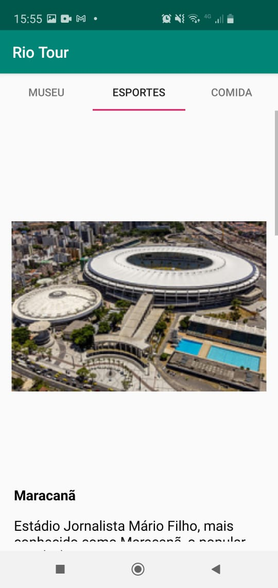

# Rio Tourism

------------

Estou em busca de uma vaga como Desenvolvedor Júnior e resolvi trazer a rede um dos projetos que desenvolvi durante o curso **ANDROID BASICS** desenvolvido pela **UDACITY** .

------------

*Esse projeto foi desenvolvido para falar de alguns pontos turísticos do Rio de Janeiro, esse é o estágio inicial dele.*

Esse é o ponto **ZERO** desse projeto e fico aberto a qualquer sugestão que possam fazer.

Irei focar nas melhorias desse projeto, até a publicação na loja.
E como já disse: Fique a vontade para sugerir outras melhorias ou funcionalidades.

# Pontos a desenvolver no projeto:

------------
### Conteúdo
1.  Atualizar os dados de cada local.
1.  Padronizar 10 pontos para cada menu.
1. Inserir a localização em mapa de cada ponto (com direcionamento waze ou Uber).
1. Inserir opção de diferentes línguas (Português e Inglês).

------------
### Visual

1. Alterar todas as fotos com adequação de diferentes tamanhos de dispositivo
1. melhorar tamanho da fonte, margens e espaçamento
1. Verificar a paleta de cores que seja mais amigável.
.
.
.

------------

### Abaixo segue o atual estado do aplicativo...
.
------------

<video width="320" height="240" controls>
  <source src="status/dia1/ponto_zero.mp4" type="video/mp4">
  Your browser does not support the video tag.
</video>

